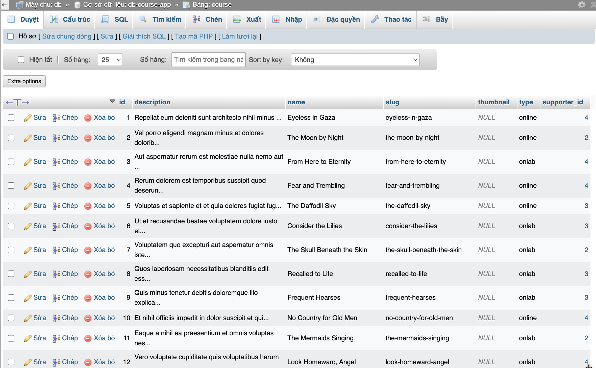

### Bài tập

Câu 1 : Tạo bảng

```sql
CREATE TABLE Customers (
   customer_id INT PRIMARY KEY,
   name VARCHAR(50),
   email VARCHAR(100)
);
```



Câu 2 : Truy vấn

```sql
CREATE TABLE Orders (
   order_id INT PRIMARY KEY,
   customer_id INT,
   order_date DATE,
   FOREIGN KEY (customer_id) REFERENCES Customers(customer_id)
);
```